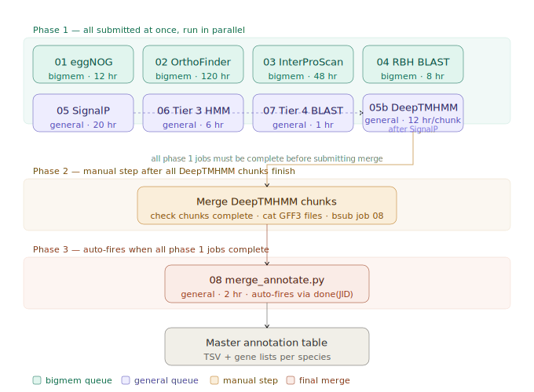

# Pipeline README

This document covers first-time setup, running the pipeline for a new species, job structure, DeepTMHMM chunking, and known issues. The pipeline is designed for LSF/BSUB HPC schedulers and was developed on the University of Miami Pegasus cluster.

---

## Contents

- [Prerequisites](#prerequisites)
- [First-Time Setup](#first-time-setup)
- [Running the Pipeline for a New Species](#running-the-pipeline-for-a-new-species)
- [Job Structure and Dependencies](#job-structure-and-dependencies)
- [DeepTMHMM Chunking](#deeptmhmm-chunking)
- [Restarting Jobs or Running the Merge Manually](#restarting-jobs-or-running-the-merge-manually)
- [Conda Environments](#conda-environments)
- [Run Directory Structure](#run-directory-structure)
- [Known Issues and Fixes](#known-issues-and-fixes)
- [Adapting to Other HPC Schedulers](#adapting-to-other-hpc-schedulers)

---

## Prerequisites

Before running the pipeline you will need:

1. **Anaconda3** installed in your home directory
2. **SignalP 6.0** academic license tarball; request from https://services.healthtech.dtu.dk/services/SignalP-6.0/
3. **DeepTMHMM academic license**; request from DTU BioLib (same portal as SignalP). Transfer `DeepTMHMM-Academic-License-v1.0.zip` to your home directory on the cluster
4. **Java 11+**: required by InterProScan (check with `java -version`; load via `module load java/11` if needed)
5. **Species proteome** (FASTA) and **GFF3** annotation file placed in a genomes directory

---

## First-Time Setup

Run the setup script **once** on the login node before any species run. It creates both conda environments, installs all tools, downloads databases, and validates the installation. Takes 2–4 hours depending on network speed (eggNOG database is ~39 GB).

```bash
bash pipeline/00_setup_annotation_env.sh
```

This script:
- Creates `annotation_env` (Python 3.11, all annotation tools)
- Creates `orthofinder_env` (OrthoFinder, MAFFT, FastTree; kept separate from annotation_env)
- Downloads and indexes UniProt SwissProt
- Extracts human and mouse SwissProt subsets for OrthoFinder
- Downloads and installs InterProScan 5.78-109.0
- Downloads eggNOG 5.0 database
- Installs SignalP 6.0 and DeepTMHMM from license tarballs
- Presses the Tier 3 HMM and Tier 4 BLAST databases
- Runs a validation check on all tools and databases

> **Note:** The *Nematostella vectensis* proteome (NV2g.20240221.protein.fa) must be downloaded manually from https://simrbase.stowers.org/nematostella and placed in your genomes directory before running OrthoFinder.

---

## Running the Pipeline for a New Species

### 1. Configure `run_config.sh`

Edit the paths at the top of `run_config.sh` for your species:

```bash
SPECIES="Pdam"
PROTEOME="/path/to/pdam_proteins.fasta"
GFF3="/path/to/pdam_annotation.gff3"
RUN_DIR="/scratch/your_project/runs/Pdam_$(date +%Y%m%d)"
```

### 2. Activate the environment

```bash
source ~/anaconda3/etc/profile.d/conda.sh
conda activate annotation_env
```

### 3. Submit all jobs

```bash
bash pipeline/submit_pipeline.sh <SPECIES>
# e.g. bash pipeline/submit_pipeline.sh Pdam
```

This generates and submits all BSUB job scripts to the run directory. Jobs are submitted with LSF dependencies so they fire in the correct order. Job scripts are written to `${RUN_DIR}/logs/` at submission time.

### 4. Monitor jobs

```bash
bjobs                          # all running jobs
bjobs -l <JID>                 # detail for one job
bpeek <JID>                    # live stdout
cat ${RUN_DIR}/logs/*.out      # completed job logs
```

---

## Job Structure and Dependencies

The pipeline runs in three phases. Phase 1 jobs are all submitted at once and run in parallel. Phase 2 requires a manual merge step for DeepTMHMM chunks. Phase 3 fires automatically once all upstream jobs are complete.




| Group | Jobs | Queue | Parallel? |
|-------|------|-------|-----------|
| Bigmem | 01 eggNOG, 02 OrthoFinder, 03 InterProScan, 04 RBH BLAST | bigmem | Yes |
| General | 05 SignalP, 06 Tier 3 HMM, 07 Tier 4 BLAST | general | Yes |
| After SignalP | 05b DeepTMHMM (one job per 2,000-seq chunk) | general | Chunks parallel |

**Phase 2** requires manually merging DeepTMHMM chunk GFF3 files (see DeepTMHMM Chunking below). This step cannot be automated because chunks may fail and require individual resubmission.

**Phase 3**: Job 08 (`merge_annotate.py`) has `done(JID)` dependencies on all upstream jobs and fires automatically once they are all complete.

---

## DeepTMHMM Chunking

DeepTMHMM loads a 2.6 GB ESM protein language model and cannot run on login nodes (OOM-killed). It must be submitted as a compute job. For large proteomes (>2,000 sequences), the proteome is automatically split into 2,000-sequence chunks by `submit_pipeline.sh`, with one BSUB job per chunk.

**Wall time: 12 hours per chunk.** Do not reduce to 6 hours; 2,000 sequences requires approximately 9 hours.

After all chunks complete, the output GFF3 files must be merged before submitting job 08:

```bash
TMHMM_DIR="${RUN_DIR}/05_tmhmm"

# 1. Check all chunks completed
for i in $(seq -w 1 14); do
    [[ -f "${TMHMM_DIR}/results/chunk_${i}/TMRs.gff3" ]] \
        && echo "chunk_${i}: OK" \
        || echo "chunk_${i}: MISSING"
done

# 2. Merge chunk GFF3 files
echo "##gff-version 3" > "${TMHMM_DIR}/TMRs.gff3"
for d in "${TMHMM_DIR}/results"/chunk_*/; do
    grep -v "^##gff-version" "${d}/TMRs.gff3" >> "${TMHMM_DIR}/TMRs.gff3"
done

# 3. Submit merge job
bsub < "${RUN_DIR}/logs/job_08_merge.bsub"
```

> **Note:** The merge job BSUB script is generated at submission time with dependency JIDs that may be stale if you are resubmitting manually. It will start immediately when submitted directly with `bsub <`.

---

## Restarting Jobs or Running the Merge Manually

If a job fails mid-pipeline or you need to resubmit the merge after manually completing DeepTMHMM chunks, follow these steps.

### Checking job status

```bash
bjobs                            # all your running/pending jobs
bjobs -l <JID>                   # detail for a specific job
cat ${RUN_DIR}/logs/*.out        # output logs for completed jobs
ls ${RUN_DIR}/logs/*.out         # list all log files
```

### Resubmitting a single failed job

BSUB scripts are written to `${RUN_DIR}/logs/` at submission time. Resubmit any individual job directly:

```bash
bsub < ${RUN_DIR}/logs/job_03_interproscan.bsub
```

Note: the resubmitted job will have new JID dependencies. If job 08 was already submitted with the old JIDs, kill it and resubmit after the failed job completes.

### Running the merge script manually

Once all upstream jobs are complete, run the merge directly without BSUB. This is useful for testing or when the auto-dependency has failed:

```bash
source ~/anaconda3/etc/profile.d/conda.sh
conda activate annotation_env

python3 pipeline/08_merge_annotate.py \
    --species Gfas \
    --run_dir /path/to/runs/Gfas_20260605 \
    --proteome /path/to/gfas_1.0.proteins.fasta \
    --gff3 /path/to/gfas_1.0.genes.gff3 \
    --db_dir /path/to/databases \
    --outdir /path/to/runs/Gfas_20260605/08_final
```

Key flags:

| Flag | Description |
|------|-------------|
| `--species` | Species abbreviation (used to name output columns and files) |
| `--run_dir` | Root of the species run directory |
| `--proteome` | Path to the species protein FASTA |
| `--gff3` | Path to the species GFF3 annotation file |
| `--db_dir` | Path to the shared databases directory |
| `--outdir` | Where to write the final TSV and gene lists |
| `--skip_kegg_api` | Skip KEGG pathway name lookup (useful for fast test runs) |

### If DeepTMHMM chunks are incomplete

Check which chunks finished and resubmit only the missing ones:

```bash
TMHMM_DIR="${RUN_DIR}/05_tmhmm"
TOTAL_CHUNKS=14   # adjust for your species

for i in $(seq -w 1 ${TOTAL_CHUNKS}); do
    if [[ ! -f "${TMHMM_DIR}/results/chunk_${i}/TMRs.gff3" ]]; then
        echo "chunk_${i}: MISSING - resubmitting"
        bsub < "${RUN_DIR}/logs/job_05b_chunk_${i}.bsub"
    else
        echo "chunk_${i}: OK"
    fi
done
```

Then once all chunks are confirmed complete, merge and submit job 08:

```bash
# Merge chunk GFF3 files
echo "##gff-version 3" > "${TMHMM_DIR}/TMRs.gff3"
for d in "${TMHMM_DIR}/results"/chunk_*/; do
    grep -v "^##gff-version" "${d}/TMRs.gff3" >> "${TMHMM_DIR}/TMRs.gff3"
done
echo "Merged: $(grep -vc '^#' ${TMHMM_DIR}/TMRs.gff3) protein topology records"

# Resubmit merge; stale JID dependencies will not block it (fires immediately)
bsub < "${RUN_DIR}/logs/job_08_merge.bsub"
```


---

## Conda Environments

Two environments are required and must be kept separate:

```bash
# Main annotation environment (all jobs except OrthoFinder)
source ~/anaconda3/etc/profile.d/conda.sh
conda activate annotation_env
# Contains: eggNOG-mapper, DIAMOND v2.2.1, HMMER 3.4, BLAST+,
#           SignalP 6.0, BioPython v1.87, pandas, numpy (<2.0),
#           fair-esm==0.4.0, h5py, PeptideBuilder, matplotlib

# OrthoFinder environment (job 02 only)
conda activate orthofinder_env
# Contains: OrthoFinder v2, MAFFT, FastTree
# DO NOT mix with annotation_env
```

`EGGNOG_DATA_DIR` and `LD_LIBRARY_PATH` are set automatically via a conda activation hook installed at `$CONDA_PREFIX/etc/conda/activate.d/eggnog.sh`.

---

## Run Directory Structure

Each species run creates the following directory structure:

```
runs/<Species>_<YYYYMMDD>/
├── logs/                    # BSUB job scripts and output logs
│   ├── job_01_eggnog.bsub
│   ├── job_01_eggnog_<JID>.out
│   └── ...
├── 01_eggnog/               # eggNOG-mapper output
├── 02_orthofinder/          # OrthoFinder output
├── 03_interproscan/         # InterProScan TSV output
├── 04_rbh/                  # DIAMOND RBH results
├── 05_signalp/              # SignalP predictions
├── 05_tmhmm/                # DeepTMHMM output (chunks + merged GFF3)
│   └── results/
│       ├── chunk_01/
│       └── ...
├── 06_tier3/                # HMMER Tier 3 hits
├── 07_tier4/                # DIAMOND Tier 4 hits
├── 08_final/                # Merge output
│   ├── <Species>_master_annotation.tsv
│   ├── <Species>_load_gene_lists.R
│   └── gene_lists/
└── py_helpers/              # Python helper scripts written at submission time
```

---

## Known Issues and Fixes

These issues were encountered during development and are fixed in the current scripts. Documented here to avoid reintroduction.

| Issue | Fix |
|-------|-----|
| `conda activate` reading species name as env name | Use `source ~/anaconda3/etc/profile.d/conda.sh` not `bin/activate`; hardcode env names |
| `${CONDA_ENV_ANNOT}` empty inside heredocs | All `conda activate` calls in BSUB heredocs use hardcoded strings |
| JID parsing captured extra output, breaking dependencies | `submit_job()` sends log line to stderr; only bare JID printed to stdout |
| InterProScan version mismatch | Use `interproscan-5.78-109.0` (not 5.71-103.0) |
| SignalP 6.0 not found in PATH | Script now checks for `signalp6` and exits gracefully if missing |
| Python heredocs caused quoting issues | Python parsers written as standalone files to `py_helpers/` |
| `run_config.sh` auto-called `configure_species` unconditionally | Now only calls if `$1` is non-empty |
| DeepTMHMM crashes if output dir exists | `rm -rf ${CHUNK_OUT}` added before each `predict.py` call |
| DeepTMHMM model files not found | Must `cd` to install directory before running `predict.py` |
| DeepTMHMM wall time exceeded at 6hr | Wall time changed to 12hr per chunk |
| SignalP OSError on long FASTA headers | Headers stripped to first word before running (required for Pdam; long headers cause OSError in SignalP) |
| `fair-esm` version 2.0.0 breaks `predict.py` | Pin to `fair-esm==0.4.0` |
| `numpy` 2.x breaks SignalP and fair-esm | Pin to `numpy<2.0` |
| matplotlib seaborn style string deprecated | `predict.py` line ~308 patched: `seaborn-whitegrid` → `seaborn-v0_8-whitegrid` |
| DeepTMHMM OOM-killed on login node | Must run as compute job; login node cannot load the 2.6 GB ESM model |
| `tmhmm_n_tmrs` column stored as float | `.fillna(0).astype(int)` applied after merge |
| eggNOG column mapping wrong | GO=col9, COG=col6, KEGG_Pathway=col12, PFAMs=col20 |
| IPS/SignalP column collision | IPS must not create `signalp_prediction` or `tmhmm_topology` columns |
| KEGG API 1,000-KO limit | Replaced with batch loop: 10 KOs/call, 0.2s sleep |
| `gfas_gene_id` hardcoded in merge script | Now dynamic: `gene_id_col = f"{species.lower()}_gene_id"` |
| `.repla('-','')` typo in pI/MW computation | Fixed to `.replace('-','')`. This bug silently returned None for all pI and MW values. |

---

## Adapting to Other HPC Schedulers

The pipeline uses LSF/BSUB. To adapt to SLURM or PBS, the following need updating in `submit_pipeline.sh`:

- `bsub <` → `sbatch` (SLURM) or `qsub` (PBS)
- `#BSUB` directives → `#SBATCH` or `#PBS`
- `done(JID)` dependency syntax → `--dependency=afterok:<JID>` (SLURM)
- `bjobs` / `bpeek` → `squeue` / `sattach` (SLURM)

All analysis commands inside the job scripts are scheduler-agnostic.
